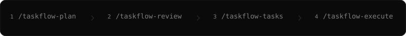

# Taskflow Skills - Claude

[](https://claude.com/claude-code)
[](https://github.com/IvanMurzak/taskflow-claude/releases)
[](#the-four-skills)
[](LICENSE)


**Tell it what you want in plain words. Get shipped pull requests.**

Taskflow reads your actual repository, writes the plan, argues with the plan,
breaks it into small tasks, and then runs those tasks — each in its own worktree,
each reviewed, each opening its own PR.

Four commands, in order. That is the whole thing.

## Install

```bash
claude plugin marketplace add IvanMurzak/pipeline-claude-marketplace
claude plugin install taskflow@pipeline
```

Already inside Claude Code? Type the same two, as slash commands:

```text
/plugin marketplace add IvanMurzak/pipeline-claude-marketplace
/plugin install taskflow@pipeline
```

That's it — no config file, no API key, no account. Restart Claude Code and the
four commands are there.

> One marketplace carries both of my Claude Code plugins, and its id is
> `pipeline` — hence the `@pipeline` suffix. The plugin you just installed is
> `taskflow`; `pipeline` is the other one.

<details>
<summary><b>Optional — add Pipeline to raise the execution ceiling</b></summary>

<br>

Taskflow already gives every task its own git worktree, and already runs several
at once, with nothing else installed. These two are opt-in:

```bash
bun add -g @baizor/pipeline                     # the Pipeline CLI, 0.17.0 or above
claude plugin install pipeline@pipeline         # the Pipeline plugin
```

**The CLI** is what `--engine=auto` looks for on your `PATH`. At 0.17.0 or above
it lifts the execution tier from `native` to `toolkit`, which adds the three
things host worker isolation structurally cannot give a task: a bound **port**, a
**worktree per submodule**, and a **base branch other than the repository
default**. Without it, only tasks needing those three stay pending — every other
task still dispatches at full concurrency. It is the *global* install that counts
here: the Pipeline plugin bundles its own copy for `/pipeline:*`, but Taskflow
resolves `pipeline` from `PATH`.

**The plugin** adds the `/pipeline:*` skills for authoring pipelines — which is
what `--engine=pipeline --pipeline=<name>` then hands each task to.

</details>

## How to use



Pick a short name for your change. Every step uses that same name.

### 1. Plan it

Tell it the story the way you'd tell a colleague:

```text
/taskflow-plan device-pairing

People with two laptops sign in separately on each one and can't see which
machines are already signed in. I want pairing: approve a new device from
one you're already on, list the devices you have, and revoke any of them.
Revoking should end that device's session and nothing else.
```

It goes and reads your code —
every claim it writes down gets a `file:line` next to it — asks you the two or
three questions that actually change the outcome, and writes the plan to
`.taskflow/YYYY-MM-DD-device-pairing/`.

### 2. Review the plan

```text
/taskflow-review device-pairing
```

Three independent reviewers try to prove the plan wrong: against your code,
against the real specs and vendor docs, and against itself. Confirmed mistakes
get fixed on the spot. Anything that is your call comes back to you as a
question.

### 3. Turn it into tasks

```text
/taskflow-tasks device-pairing
```

The plan becomes numbered, immutable task specs — grouped so that two tasks in
the same wave can never touch the same files — plus a status board in
`ROADMAP.md`.

### 4. Execute

```text
/taskflow-execute device-pairing
```

> Best run in a **fresh context window**. It is a long job, and it does not need
> anything from the conversation you just had — everything it needs is on disk.

It works through the board: one task per git worktree, verified against the
repository rather than against what a worker claims, one PR each, board updated
after each one. Nothing merges without you unless you ask for that.

Want it faster, and reviewed as it goes?

```text
/taskflow-execute device-pairing --parallel=4 --review=high
```

## What lands on disk

```text
.taskflow/2026-08-10-device-pairing/
├── README.md                    the problem, and every decision you locked
├── ROADMAP.md                   the live status board — the only file that changes
├── 01-current-architecture.md   what your code does today, with file:line proof
├── 02-target-architecture.md    what it should do, and the D1..Dn decisions
├── 06-migration-rollout.md      phases, gates, rollback
├── 07-security.md               credentials, threats, controls
└── tasks/
    ├── a1-auth-token-store.md   immutable specs — written once, never edited
    └── b1-pairing-plane.md
```

`ROADMAP.md` is the only mutable record. Task specs never carry status, so a
half-finished run can never lie to you about where it got to.

---

## Documentation

- [The four skills](#the-four-skills)
- [`/taskflow-execute` flags](#taskflow-execute-flags)
- [Execution tiers](#execution-tiers)
- [Why `--merge` defaults to `on-green`](#why---merge-defaults-to-on-green)
- [Workflow contract](#workflow-contract)
- [What ships in this repository](#what-ships-in-this-repository)
- [License](#license)

## The four skills

| Skill | What it does | Writes |
|---|---|---|
| `/taskflow-plan` | Explores every affected repository, asks the owner the decisions that change the outcome, and writes a self-contained architecture set. Every factual claim about existing code carries a `file:line` found in that session. | `.taskflow/YYYY-MM-DD-<slug>/` |
| `/taskflow-review` | Runs three independent adversarial reviews — repository truth, external conformance, internal consistency — then applies the confirmed non-product corrections in one batch. Product questions come back to you. | corrections in place |
| `/taskflow-tasks` | Decomposes the reviewed plan into immutable, PR-sized task specs with dependencies, conflict-safe groups, model routing tiers, and ROADMAP waves. | `<slug>/tasks/` + the board |
| `/taskflow-execute` | Schedules. Computes what is ready, dispatches inside dependency and conflict limits, verifies against the repository rather than a worker's report, and is the sole writer of the board. | PRs + `ROADMAP.md` |

Any user or agent may invoke any stage. No skill pins a model.

### `/taskflow-plan`

Give it the story and a short slug. It resolves `.taskflow/YYYY-MM-DD-<slug>/`,
states the path, asks 2–4 focused questions while it starts exploring, and
writes the document set — current architecture, target architecture, actor
flows, subsystem rules, infrastructure, migration, security, and user
workflows — plus the `ROADMAP.md` skeleton.

Two rules it will not bend: every statement about existing code needs evidence
found in that session, and product policy (deployment target, compatibility,
identity, UX, monetization, scope, anything irreversible) is yours to decide,
recorded as `D1..Dn`.

### `/taskflow-review`

Reviewers try to **disprove** the plan, and a finding is only applied after it
has been verified against evidence — a plausible but false correction is worse
than no correction. Mechanical fixes are applied; anything touching product
policy is surfaced to you instead.

### `/taskflow-tasks`

Runs only on a locked, reviewed plan with no open product question. Produces one
immutable file per PR-able task, a group table with the conflict rules, model
routing tiers (`security_critical` and `production_touching` route higher), and
the ROADMAP waves.

### `/taskflow-execute`

Reads the board, reconciles every non-pending row against real repository
evidence — branches, commits, merged revisions, PRs, CI state — *before* it
dispatches anything, and only then starts work. It schedules; it does not
implement. Implementation happens in `taskflow-implementer` workers, review in
`taskflow-reviewer`, and a worker never reviews its own diff.

## `/taskflow-execute` flags

Every flag is optional and every default is shown below. This table is kept in
lockstep with `skills/taskflow-execute/SKILL.md` §3, which wins if the two ever
disagree.

| Flag | Values | Default | Notes |
|---|---|---|---|
| `<slug>` (positional) | a taskflow folder under `.taskflow/` | the only folder there | ambiguity is resolved with you, never guessed |
| `--scope=` | `all` · `wave:N` · `group:B` · comma-separated id list | `all` | free-text scope after the slug is also accepted |
| `--parallel=` | `1` · `N` · `auto` | `1` | `>1` (or `auto`) enables concurrent dispatch |
| `--engine=` | `auto` · `native` · `toolkit` · `pipeline` | `auto` | picks the execution tier — see below |
| `--pipeline=` | a pipeline name | — | only valid together with `--engine=pipeline` |
| `--review=` | `off` · `low` · `medium` · `high` · `xhigh` | `off` | anything but `off` dispatches a reviewer that is never the implementer |
| `--merge=` | `ask` · `on-green` · `never` | `on-green` | `native`/`toolkit` only — see below |
| `--submodules=` | `auto` · `off` | `auto` | `auto` means "run the sync only when `git submodule status` is non-empty" |
| `--solo=` | comma-separated id list | empty | forces single-slot dispatch for a task that needs an exclusive resource |
| `--on-fail=` | `continue` · `stop` | `continue` | `stop` drains the in-flight slots and halts the run |
| `--dry-run` | flag | off | prints the resolved plan — flags, ready set, slots, tier, withheld tasks — and dispatches nothing |

An unrecognized `--flag`, or a value outside a flag's vocabulary, stops the run
rather than silently falling back to a default. Every resolved value — including
defaults nobody typed — is printed before dispatch begins.

Two things are fixed and not configurable: the review fix-round budget (`K = 2`)
and the concurrency ceiling (`8`).

## Execution tiers

`--engine` picks the substrate that provisions a task's working directory.
Default `auto`.

| Tier | Needs | Provides |
|---|---|---|
| `native` | Nothing beyond Claude Code's own worker isolation — no CLI required | One worktree per task, with an enforced main-checkout boundary. Cannot allocate a port, cannot give a task its own submodule worktree, and cannot cut a worktree from any branch but the repository's default. |
| `toolkit` | The `pipeline` CLI at or above **0.17.0** — the first published release whose `worktree list --json` reports a hook-provisioned slot's submodule directories. `--engine=auto` resolves to `toolkit` at or above that version; below it, absent, or unparseable ⇒ `native`, and the run says why | Everything `native` provides, plus a port block, per-submodule worktrees, an arbitrary base branch, `ci-wait`, `submodule bump` and `gc` |
| `pipeline` | Explicit `--engine=pipeline --pipeline=<name>` | Each task becomes one `pipeline drive` run, which owns implement → review → PR → CI → merge → sync itself. `--merge` does not apply here |

Because `native` needs nothing beyond Claude Code itself, **parallel dispatch
works with no CLI installed at all** — worker isolation is a host feature, not a
CLI feature. What the CLI adds is the three things native isolation structurally
cannot provide, so without it a run withholds exactly three classes of task:

- a task that needs a bound **port** — the host places a worktree, it does not
  hand out a port block;
- a task whose `repo:` is a **submodule** — host isolation covers the
  superproject checkout, not a worktree per submodule;
- a task that must integrate on a **base branch other than the repository
  default** — the host's worktree placement accepts only "fresh" or "head",
  never a named branch.

A withheld task's row stays pending, not failed. The reason is reported once per
run — naming the tier, the gap, and the affected task ids — and every other ready
task still dispatches at full concurrency.

Each task runs inside its own git worktree, never the shared checkout; the host
blocks edits and git commands redirected at the main checkout for that worker and
every subagent it spawns. That boundary is partial rather than absolute — see
`agents/taskflow-implementer.md` for the measured enforcement matrix before
relying on it for anything you have not verified yourself.

## Why `--merge` defaults to `on-green`

`on-green` merges only after DoD verification, required review, required CI,
and owner gates pass. It never bypasses branch protection. Use `ask` to hold for
manual approval or `never` to leave verified PRs open. The `pipeline` tier owns
its own merge policy.

## Workflow contract

- Artifacts live only in `.taskflow/YYYY-MM-DD-<slug>/`. Prefix every new folder
  with its local creation date; do not rename existing folders.
- `ROADMAP.md` is the sole mutable task-state record. Task specs are immutable
  and never contain `status`.
- Task groups run sequentially by `sequence`; independent groups may run in
  parallel when their `needs` dependencies allow it and `--parallel` is raised
  above its default.
- `security_critical` and `production_touching` raise the model-routing tier.
- Production, money, secrets, irreversible effects, and product decisions require
  an explicit owner gate.

## What ships in this repository

```text
.claude-plugin/plugin.json        the plugin manifest
skills/taskflow-plan/             ┐
skills/taskflow-review/           │ the four public skills
skills/taskflow-tasks/            │
skills/taskflow-execute/          ┘ + references/ loaded only when a flag asks
agents/taskflow-implementer.md    the per-task worker
agents/taskflow-reviewer.md       the reviewer, never the implementer
docs/taskflow-claude.svg          the animation at the top of this file
```

`skills/taskflow-execute/references/` — `parallel-execution.md`,
`code-review.md`, `submodules.md` — are read **only** when the matching flag is
set, so a plain `/taskflow-execute <slug>` loads one file and no more.

## License

[MIT](LICENSE) © Ivan Murzak
